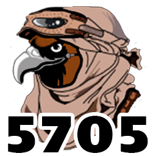
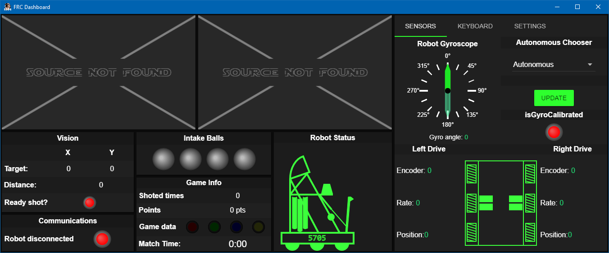

[](https://github.com/Team5705/Dashboard2022)
# 5705 Dashboard 2022

This is our newest web based FRC Dashboard to 20-21 challange.

---------
## Rquirements
* [nodejs](https://nodejs.org/)
* [npm](https://npmjs.com/)

Before running your dashboard, you'll need to install the node dependencies by cding into the dashboard directory and running ``npm install``.

---------
## Running
Connect to your robot's network if you haven't already. (If you're just testing the dashboard and don't currently need to use it with your robot, you can skip this step.)

While in the dashboard directory, run:

```npm start```

This will open the dashboard application. Note that you can refresh the page and client-side updates will take effect; reopening the whole application is usually unnecessary.

It is recommended that while using the dashboard on your driver station, you close the top panel of the FRC DriverStation to make room for the dashboard.

----------

## Building
Some users may wish to compile their dashboard applications into standalone ``.exe`` or ``.app`` files.

Assuming the necessary setup steps have been performed, users may run ``npm run package-[platform]``, where ``[platform]`` is ``linux``, ``mac``, or ``win`` according to the target platform, to pack the entire application into a single executable.

----------

### Tools
* [AngularJS](https://angularjs.org/)
* [Pallete Generator](http://mcg.mbitson.com/)
* [Angular Material](https://material.angularjs.org/)
* [SVG path editor](https://yqnn.github.io/svg-path-editor/)

----------

#### Acknowledgments
[FRC Dashboard](http://frcdashboard.github.io/)


## Screenshots
